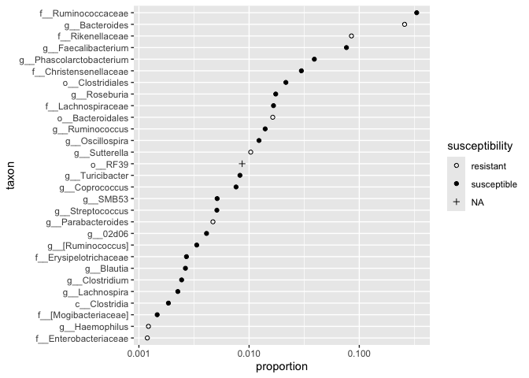
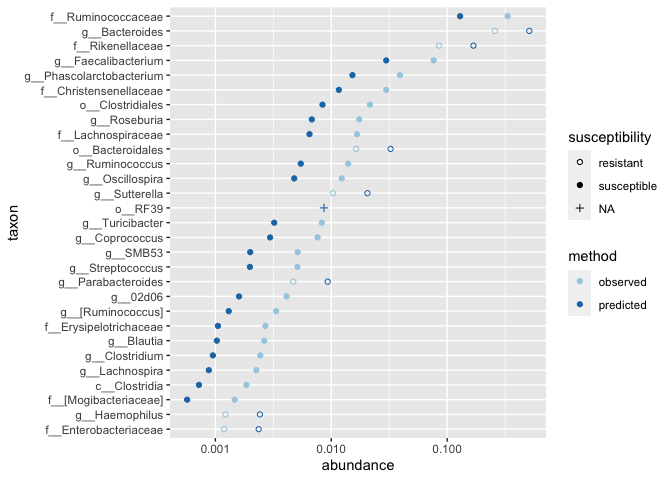

<!-- README.md is generated from README.Rmd. Please edit that file -->

# mirix

<!-- badges: start -->

[](https://github.com/PennChopMicrobiomeProgram/mirix/actions/workflows/R-CMD-check.yaml)
[](https://codecov.io/gh/PennChopMicrobiomeProgram/mirix)
<!-- badges: end -->

The goal of mirix is to calculate the Microbiome Response Index (MiRIx)
for a given bacterial community. Often this will be used to predict the
community’s susceptibility to an antibiotic.

## Installation

You can install the development version of mirix with `devtools`:

``` r
#install.packages("devtools")
devtools::install_github("PennChopMicrobiomeProgram/mirix")
```

## Calculating antibiotic index values

Here, we’ll load the `mirix` package, demonstrate some basic tasks, and
give some pointers for its use. Although we could accomplish all our
tasks in base R, the `mirix` package works very nicely with functions
from the tidyverse. We’ll import those functions now.

``` r
library(tidyverse)
```

Next, we’ll load the `mirix` library.

``` r
library(mirix)
```

This package comes with a built-in data set, `weiss2021_data`, from a
study of the gut microbiota in children with sepsis (PMID 33786436). The
children in this study were exposed to a range of antibiotics, and fecal
samples were collected across a series of time windows after diagnosis
(`study_window` A-E). Bacterial communities in the fecal samples were
profiled by sequencing the 16S rRNA gene, which serves as a fingerprint
to identify bacteria in each sample. The study included samples from a
set of healthy children in a similar age group for comparison. Here is a
summary of the number of samples in each time window:

``` r
weiss2021_data %>%
  distinct(sample_id, study_group, study_window) %>%
  count(study_group, study_window) %>%
  knitr::kable()
```

| study_group | study_window |   n |
|:------------|:-------------|----:|
| Healthy     | NA           |  44 |
| Sepsis      | A            |  17 |
| Sepsis      | B            |   9 |
| Sepsis      | C            |   7 |
| Sepsis      | D            |   2 |
| Sepsis      | E            |   8 |

for each sample collected, the data frame contains the relative
abundance of all bacteria with a proportion of more than 0.001. Here is
one of the sepsis samples, from subject 19019 in time window A. In this
sample, the sequencing results indicated the following types of
bacteria:

``` r
weiss2021_data %>%
  filter(sample_id %in% "Sepsis.19019.A") %>%
  select(lineage, proportion) %>%
  knitr::kable()
```

| lineage                                                                                                                          | proportion |
|:---------------------------------------------------------------------------------------------------------------------------------|-----------:|
| k\_\_Bacteria; p\_\_Firmicutes; c\_\_Bacilli; o\_\_Lactobacillales; f\_\_Enterococcaceae; g\_\_Enterococcus                      |  0.5491550 |
| k\_\_Bacteria; p\_\_Firmicutes; c\_\_Bacilli; o\_\_Lactobacillales; f\_\_Lactobacillaceae                                        |  0.3418542 |
| k\_\_Bacteria; p\_\_Proteobacteria; c\_\_Gammaproteobacteria; o\_\_Pseudomonadales; f\_\_Pseudomonadaceae; g\_\_Pseudomonas      |  0.0825587 |
| k\_\_Bacteria; p\_\_Proteobacteria; c\_\_Gammaproteobacteria; o\_\_Enterobacteriales; f\_\_Enterobacteriaceae                    |  0.0094255 |
| k\_\_Bacteria; p\_\_Proteobacteria; c\_\_Gammaproteobacteria; o\_\_Xanthomonadales; f\_\_Xanthomonadaceae; g\_\_Stenotrophomonas |  0.0069635 |
| k\_\_Bacteria; p\_\_Firmicutes; c\_\_Bacilli; o\_\_Bacillales; f\_\_Staphylococcaceae; g\_\_Staphylococcus                       |  0.0051231 |
| k\_\_Bacteria; p\_\_Actinobacteria; c\_\_Actinobacteria; o\_\_Actinomycetales; f\_\_Propionibacteriaceae                         |  0.0027708 |

For each type of bacteria, the taxonomic assignment includes all the
taxon names from the kingdom on down to the most specific taxon that
could be determined from the sequence, in most cases the genus.
Following the [NCBI taxonomy
browser](https://www.ncbi.nlm.nih.gov/taxonomy), we call this result the
lineage.

Our goal will be to use the lineage information to predict which
bacteria in each sample would be susceptible or resistant to various
antibiotics. For a given antibiotic, we construct an
*antibiotic-specific* Mircrobiome Response Index by taking the log-ratio
of the abundance for susceptible organisms over that of resistant
organisms.

If the bacterial community is dominated by susceptible organisms, the
index will be positive Conversely, the index is negative if susceptible
organisms constitute a minority. If an antibiotic has the predicted
effect on a bacterial community, the index should decrease after the
antibiotic is introduced.

Let’s compute the vancomycin response index for each sample in the
study.

``` r
weiss2021_vanc <- weiss2021_data %>%
  group_by(sample_id, study_group, study_window) %>%
  summarise(vanc = mirix_vancomycin(proportion, lineage), .groups = "drop")

weiss2021_vanc %>%
  ggplot(aes(x=study_window, y = vanc)) +
  geom_boxplot() +
  facet_grid(~ study_group, scales = "free_x", space = "free_x") +
  labs(x = "Study window", y = "Vancomycin-specific index")
```

<!-- -->

For healthy children, the median value of the index is about -0.2,
whereas it is roughly -0.85 across the samples from children with
sepsis. Let’s look further into how the index was calculated, and check
out which bacteria were labeled as susceptible or resistant to
vancomycin.

## Susceptible and resistant bacteria

The `mirix` library offers some lower-level functions that show more
details about how the index was calculated. For each antibiotic with an
index function, there is an accompanying function to determine the
susceptibility for each lineage. Let’s list out the susceptibility for
the lineages in the sample from subject 19019:

``` r
weiss2021_data %>%
  filter(sample_id %in% "Sepsis.19019.A") %>%
  mutate(susceptibility = antibiotic_susceptibility_vancomycin(lineage)) %>%
  select(lineage, susceptibility) %>%
  knitr::kable()
```

| lineage                                                                                                                          | susceptibility |
|:---------------------------------------------------------------------------------------------------------------------------------|:---------------|
| k\_\_Bacteria; p\_\_Firmicutes; c\_\_Bacilli; o\_\_Lactobacillales; f\_\_Enterococcaceae; g\_\_Enterococcus                      | susceptible    |
| k\_\_Bacteria; p\_\_Firmicutes; c\_\_Bacilli; o\_\_Lactobacillales; f\_\_Lactobacillaceae                                        | susceptible    |
| k\_\_Bacteria; p\_\_Proteobacteria; c\_\_Gammaproteobacteria; o\_\_Pseudomonadales; f\_\_Pseudomonadaceae; g\_\_Pseudomonas      | resistant      |
| k\_\_Bacteria; p\_\_Proteobacteria; c\_\_Gammaproteobacteria; o\_\_Enterobacteriales; f\_\_Enterobacteriaceae                    | resistant      |
| k\_\_Bacteria; p\_\_Proteobacteria; c\_\_Gammaproteobacteria; o\_\_Xanthomonadales; f\_\_Xanthomonadaceae; g\_\_Stenotrophomonas | resistant      |
| k\_\_Bacteria; p\_\_Firmicutes; c\_\_Bacilli; o\_\_Bacillales; f\_\_Staphylococcaceae; g\_\_Staphylococcus                       | susceptible    |
| k\_\_Bacteria; p\_\_Actinobacteria; c\_\_Actinobacteria; o\_\_Actinomycetales; f\_\_Propionibacteriaceae                         | susceptible    |

Looking down the list of taxa, we can see that three of the seven are
from the *Firmicutes* phylum, in which the organisms are generally
characterized by a Gram-positive cell wall structure. Vancomycin’s
mechanism of action is to disrupt construction of the cell wall in
Gram-positive organisms, so we would generally predict that organisms in
this phylum would be susceptible to the antibiotic. Likewise, the
*Actinobacteria* are Gram-positive, so the final lineage is predicted to
be susceptible. The three remaining lineages are Gram-negative organisms
from the *Proteobacteria*, and are predicted to be resistant.

Now, if you’ve read the Wikipedia article on vancomycin, you might know
that most species of *Lactobacillus* are naturally resistant to the
drug, although they are Gram-positive bacteria in the *Firmicutes*
phylum. Here, we don’t have an assignment to the *Lactobacillus* genus,
but instead to the *Lactobacillaceae* family, so the prediction stands
as susceptible.

## Databases for bacterial phenotypes and antibiotic susceptibility

The `mirix` package comes with two built-in databases. The
`taxon_phenotypes` database contains information on Gram-stain and
aerobic status for over 900 bacterial taxa. The taxa were selected to
cover many taxa encountered in the human microbiome. It is here where we
note that the *Firmicutes* are generally Gram-positive.

``` r
whatbacteria::taxon_phenotypes %>%
  filter(taxon %in% "Firmicutes")
#>        taxon   rank aerobic_status    gram_stain                     doi
#> 1 Firmicutes Phylum           <NA> Gram-positive 10.1099/00207713-28-1-1
```

The second database `taxon_susceptibility`, contains information about
bacterial susceptibility to specific antibiotics. It is here, for
example, where we note that *Lactobacillus* species are typically
resistant to vancomycin.

``` r
whatbacteria::taxon_susceptibility %>%
  filter(taxon %in% "Lactobacillus")
#>           taxon  rank antibiotic     value                  doi
#> 1 Lactobacillus Genus vancomycin resistant 10.1128/AEM.01738-18
```

If you need to add or modify information in these databases, you can
copy the data frames to new variables, make the changes you’d like, and
pass the new databases directly to the `mirix_vancomycin()` or
`antibiotic_susceptibility_vancomycin()` functions.

## Predicting taxon abundances for a given value of the index

In addition to calculating the antibiotics index for a given sample, we
can predict what the abundances in a sample might look like at a given
value of the index. Our approach is to re-balance the total abundances
of resistant and susceptible bacteria in the sample, while preserving
the relative abundances within the resistant taxa and within the
susceptible taxa. Our method will also preserve the total abundance of
each sample, in case the total abundance is not equal to 1. For taxa
that are not annotated as either resistant or susceptible, we don’t
change the abundance at all.

We’ll use a healthy control sample, `Healthy.6`, to demonstrate. First,
we’ll calculate the susceptibility to vancomycin for each lineage.

``` r
healthy6_data <- weiss2021_data %>%
  filter(sample_id %in% "Healthy.6") %>%
  mutate(taxon = word(lineage, -1)) %>%
  mutate(taxon = fct_reorder(taxon, proportion)) %>%
  mutate(susceptibility = antibiotic_susceptibility_vancomycin(lineage))
```

Above, we also made a shorter label for the taxa and sorted the values
based on proportion in the sample, to aid in plotting. Here is a chart
of the taxon abundances and their susceptibility.

``` r
healthy6_data %>%
  ggplot(aes(x = proportion, y = taxon, shape = susceptibility)) +
  geom_point() +
  scale_x_log10() +
  scale_shape_manual(values = c(1, 19), na.value = 3)
```

<!-- -->

Most taxa in the sample are annotated as susceptible to vancomycin,
including the most abundant taxon, *Ruminococcaceae*. One taxon, RF39,
is not annotated. Only a few taxa are annotated as resistant to
vancomycin, thus it’s not surprising that the vancomycin index for the
sample is posgative.

``` r
healthy6_data %>%
  summarise(vanc = mirix_vancomycin(proportion, lineage))
#> # A tibble: 1 × 1
#>    vanc
#>   <dbl>
#> 1 0.207
```

How would we expect the proportions to change if the index increased to
a negative value, say -0.5? We can use `predict_abundance()` to run the
calculation.

``` r
healthy6_data %>%
  mutate(predicted = predict_abundance(-0.5, proportion, susceptibility)) %>%
  rename(observed = proportion) %>%
  pivot_longer(
    c(observed, predicted), names_to = "method", values_to = "abundance") %>%
  ggplot(aes(x = abundance, y = taxon, color = method, shape = susceptibility)) +
  geom_point() +
  scale_x_log10() +
  scale_shape_manual(values = c(1, 19), na.value = 3) +
  scale_color_brewer(palette = "Paired")
```

<!-- -->

Here, we can see that the abundances have increased for the resistant
taxa, such as *Bacteroides* (near the top) and *Enterobacteriaceae* (at
the bottom). For susceptible taxa, the abundances have decreased. For
the taxon that’s not annotated, RF39 (near the middle), the abundance
has not changed at all.

To finish, let’s re-calculate the vancomycin index for our predicted
abundances, so we can verify that it has the expected value of -0.5.

``` r
healthy6_data %>%
  mutate(predicted = predict_abundance(-0.5, proportion, susceptibility)) %>%
  summarise(vanc = mirix_vancomycin(predicted, lineage))
#> # A tibble: 1 × 1
#>    vanc
#>   <dbl>
#> 1  -0.5
```
